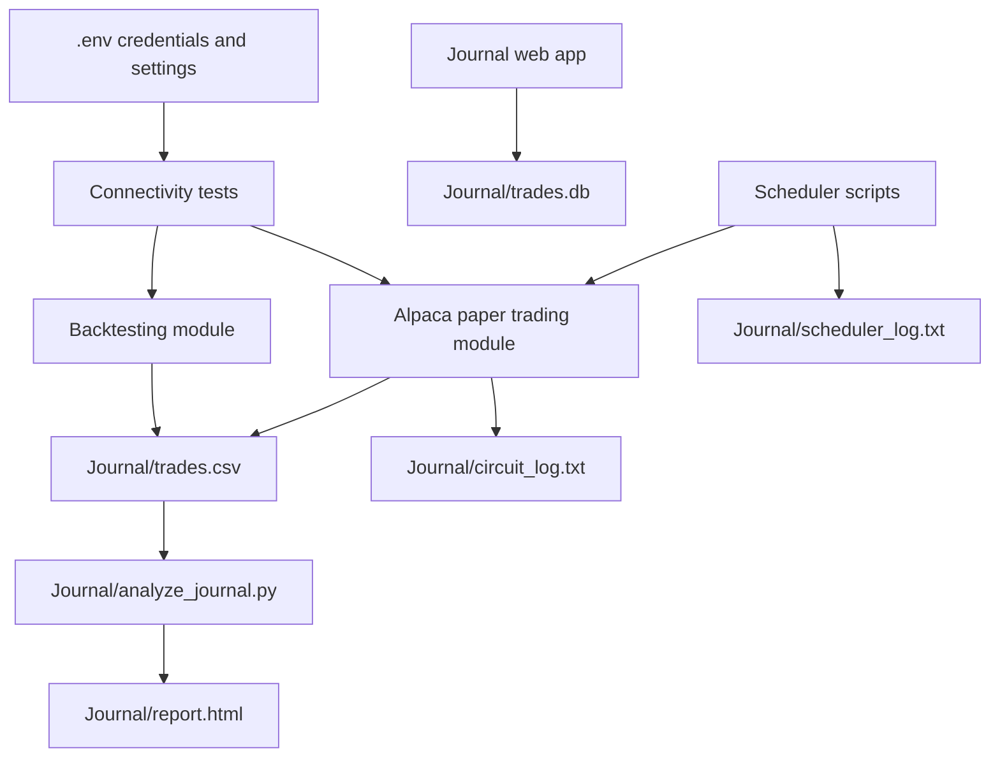

<!-- markdownlint-disable MD013 -->

# Trading Toolkit for Alpaca Paper Trading, Backtesting, and Journaling

Beginner friendly trading tools for learning strategy testing, paper trading, scheduling, and trade review without risking real money.

> [!WARNING]
> This repository is educational tooling. It is not financial advice, not a promise of profitability, and not a substitute for risk management.
> [!IMPORTANT]
> Paper trading is safer than live trading because it uses simulated money, but paper results do not guarantee live results. Real markets include slippage, partial fills, latency, changing spreads, and emotional pressure.

## What This Repository Does

This project gives you a step by step workflow for learning systematic trading with Alpaca.

It helps you:

- test ideas on historical data before placing orders
- run paper trading bots against Alpaca's simulated brokerage environment
- schedule bots to run automatically
- log trades locally for review
- analyze trade results with journal reports and a web journal
- learn trading concepts alongside the code

## Who This Is For

This repository is designed for four types of users:

1. complete beginners to trading who need plain English explanations of terms and workflow
2. complete beginners to programming who want copy paste setup steps
3. intermediate users who want a quick path from clone to first successful run
4. technical users who want architecture, file level guidance, and implementation details

## What Paper Trading Means

Paper trading means placing simulated trades with fake money while using real market data and real order logic.

Why it is safer than live trading:

- you can test your workflow without risking capital
- you can verify your API keys, scripts, and scheduler setup
- you can learn how orders and positions behave before using real money
- you can collect journal data before deciding whether a strategy is worth further study

Why it is still not the same as live trading:

- fills can be unrealistically favorable
- there is no real emotional pressure
- commissions, slippage, and liquidity effects may differ
- market conditions can change after a backtest or paper run

## Feature Overview

| Module | Purpose | Typical User | Main Outputs |
| --- | --- | --- | --- |
| `src/` | Pure PowerShell module suite for Alpaca Trading API and Market Data API. Modular, testable, paper-only. Replaces `Alpaca/alpaca_paper.ps1` for serious PS usage. | PowerShell engineers and automation workflows | account objects, order results, position objects, trade update events, bar/quote/trade data, risk state JSON |
| `Alpaca/` | Paper trading commands, connectivity tests, and safety checks | New users and operators | account status, quotes, orders, circuit breaker logs |
| `Backtesting/` | Historical strategy testing and live strategy runners | Learners and strategy developers | trade summaries, journal CSV rows, live logs |
| `Journal/` | Trade review, analytics, CSV export, and HTML reporting | Anyone reviewing results | `trades.db`, `trade_journal.csv`, `report.html` |
| `Learning Roadmap/` | Guided learning path from basics to multi strategy workflows | Complete beginners | study plan, next steps, example prompts |
| `Scheduler/` | Automation entry points for scheduled runs | Windows and shell users | `Journal/scheduler_log.txt` |
| `rsi_macd_bot/` | Fully automated RSI plus MACD signal bot using Alpaca market orders | Intermediate and technical users | `trades.log`, market and stop orders |
| `btc-signal-executor/` | TradingView webhook executor for fully automated BTC signal routing | Intermediate and technical users | `executor.log`, market orders from webhook alerts |
| `Tests/` | Fast validation of strategy logic and API connectivity | Contributors and careful operators | pytest pass, fail, or skip results |

## Repository Structure

```text
Trading/
|-- .env.example                 # Template for local secrets and optional bot safety settings
|-- .gitignore                  # Prevents local secrets and virtual environments from being committed
|-- LICENSE                     # MIT license
|-- README.md                   # Main landing page and setup guide
|-- requirements.txt            # Python dependencies used by the project
|-- Alpaca/
|   |-- README.md               # Alpaca module guide
|   |-- alpaca_paper.py         # Python command line paper trading helper and EMA bot
|   |-- alpaca_paper.ps1        # PowerShell paper trading helper
|   |-- circuit_breaker.py      # Safety checks for loss streaks and API failures
|   |-- paper_trade.py          # Scheduler friendly Python entry point for paper trading
|   |-- Test-AlpacaConnection.ps1 # Read only PowerShell connectivity test using LastPass CLI
|-- Backtesting/
|   |-- README.md               # Backtesting and live strategy guide
|   |-- backtest.py             # Simple Yahoo Finance based multi strategy backtester
|   |-- strategies/             # Strategy classes, backtest runners, live runners, and PowerShell wrappers
|-- Journal/
|   |-- README.md               # Journal app and reporting guide
|   |-- journal_server.py       # Flask web server for the trade journal UI
|   |-- journal.html            # Front end for logging and reviewing trades
|   |-- analyze_journal.py      # CSV journal summarizer that writes report.html
|   |-- trades.csv              # CSV journal used by strategy scripts and report generator
|   |-- report.html             # Generated HTML summary report
|   |-- circuit_log.txt         # Circuit breaker safety log
|   |-- scheduler_log.txt       # Scheduler run log
|-- Learning Roadmap/
|   |-- README.md               # Beginner friendly roadmap overview
|   |-- ROADMAP.md              # Deeper phase by phase strategy roadmap
|-- Scheduler/
|   |-- README.md               # Scheduling guide for Windows and shell users
|   |-- run_strategy.ps1        # Windows scheduler launcher for Alpaca/paper_trade.py
|   |-- run_strategy.sh         # Shell scheduler launcher for Alpaca/paper_trade.py
|-- rsi_macd_bot/
|   |-- README.md               # RSI plus MACD bot guide
|   |-- config.py               # Bot settings for symbols, indicators, and risk limits
|   |-- data_fetcher.py         # Historical bar retrieval helpers
|   |-- indicators.py           # RSI plus MACD calculations and signal rules
|   |-- order_manager.py        # Position checks, sizing, market orders, and stop orders
|   |-- logger.py               # Rotating signal and order event logger
|   |-- bot.py                  # Main scan loop that runs every 5 minutes
|   |-- .env.example            # Bot specific environment template
|   |-- requirements.txt        # Bot specific dependencies
|-- btc-signal-executor/
|   |-- README.md               # TradingView webhook executor guide
|   |-- main.py                 # FastAPI app and /webhook endpoint
|   |-- executor.py             # Alpaca order routing logic
|   |-- validator.py            # Payload schema and passphrase checks
|   |-- config.py               # Environment configuration loader
|   |-- .env.example            # Executor env template
|   |-- requirements.txt        # Executor dependencies
|-- Tests/
|   |-- README.md               # Test guide and interpretation help
|   |-- test_connection.py      # Live Alpaca connectivity checks using .env credentials (Python)
|   |-- test_ema_crossover.py   # Synthetic tests for EMA strategy logic
|   |-- test_bollinger_rsi.py   # Synthetic tests for Bollinger plus RSI logic
|   |-- test_gap_momentum.py    # Synthetic tests for intraday gap logic
|   |-- test_rsi_stack.py       # Synthetic tests for multi timeframe RSI logic
|-- src/
|   |-- Alpaca.Config/
|   |   |-- Alpaca.Config.psm1          # .env loader, URL constants, paper-mode enforcer
|   |   |-- Alpaca.Config.psd1          # Module manifest
|   |-- Alpaca.Auth/
|   |   |-- Alpaca.Auth.psm1            # Auth headers, Invoke-AlpacaRequest wrapper, Write-AlpacaLog
|   |   |-- Alpaca.Auth.psd1
|   |-- Alpaca.Trading.Account/
|   |   |-- Alpaca.Trading.Account.psm1 # Get-AlpacaAccount, Get-AlpacaClock, Get-AlpacaCalendar
|   |   |-- Alpaca.Trading.Account.psd1
|   |-- Alpaca.Trading.Assets/
|   |   |-- Alpaca.Trading.Assets.psm1  # Get-AlpacaAsset, Get-AlpacaAssets
|   |   |-- Alpaca.Trading.Assets.psd1
|   |-- Alpaca.Trading.Orders/
|   |   |-- Alpaca.Trading.Orders.psm1  # Submit-AlpacaOrder, Get-AlpacaOrder(s), Remove-AlpacaOrder(s)
|   |   |-- Alpaca.Trading.Orders.psd1
|   |-- Alpaca.Trading.Positions/
|   |   |-- Alpaca.Trading.Positions.psm1 # Get-AlpacaPosition(s), Close-AlpacaPosition, Close-AllAlpacaPositions
|   |   |-- Alpaca.Trading.Positions.psd1
|   |-- Alpaca.Streams.TradeUpdates/
|   |   |-- Alpaca.Streams.TradeUpdates.psm1 # Start-AlpacaTradeUpdateStream (WebSocket, primary order state)
|   |   |-- Alpaca.Streams.TradeUpdates.psd1
|   |-- Alpaca.MarketData.Historical/
|   |   |-- Alpaca.MarketData.Historical.psm1 # Get-AlpacaBars, Get-AlpacaLatestBar/Quote/Trade/Snapshot
|   |   |-- Alpaca.MarketData.Historical.psd1
|   |-- Alpaca.MarketData.Stream/
|   |   |-- Alpaca.MarketData.Stream.psm1 # Start-AlpacaMarketDataStream (WebSocket, trades/quotes/bars)
|   |   |-- Alpaca.MarketData.Stream.psd1
|   |-- Alpaca.Risk/
|   |   |-- Alpaca.Risk.psm1            # Kill switch, daily loss, duplicate prevention, order validation
|   |   |-- Alpaca.Risk.psd1
|-- examples/
|   |-- Get-AccountStatus.ps1           # Account status and clock via PowerShell modules
|   |-- Submit-PaperOrder.ps1           # Risk-gated paper order template
|   |-- Start-TradeUpdateStream.ps1     # Live trade_updates WebSocket with console output
|   |-- Get-HistoricalBars.ps1          # Historical bar pull with summary stats
|   |-- Connect-FakepacaStream.ps1      # FAKEPACA smoke test for market data stream
|-- tests/
|   |-- Test-AlpacaConfig.Tests.ps1     # Pester tests: config loading and paper-mode enforcement
|   |-- Test-AlpacaAuth.Tests.ps1       # Pester tests: auth headers and request wrapper
|   |-- Test-AlpacaRisk.Tests.ps1       # Pester tests: kill switch, daily loss, duplicate prevention
|   |-- Test-AlpacaTradeUpdateParsing.Tests.ps1 # Pester tests: trade update event parsing
|   |-- Test-AlpacaMarketDataParsing.Tests.ps1  # Pester tests: market data frame parsing
```

## Architecture and Workflow

The repo uses a simple flow:

1. put credentials in a local `.env` file
2. verify connectivity to Alpaca paper trading
3. backtest a strategy
4. run the same or similar logic in paper trading mode
5. review results in the journal and reports
6. automate safe runs with the scheduler



## PowerShell and Python Responsibilities

This repo intentionally uses both PowerShell and Python.

| Tooling Layer | Main Responsibility | Examples |
| --- | --- | --- |
| PowerShell | automation, scheduling, task launch, Windows friendly workflows | `Scheduler/run_strategy.ps1`, `Backtesting/strategies/run_ema.ps1`, `Alpaca/alpaca_paper.ps1` |
| Python | trading logic, API calls, backtests, live runners, journal services | `Alpaca/alpaca_paper.py`, `Backtesting/strategies/*.py`, `Journal/journal_server.py` |

Use PowerShell when you want to orchestrate tasks on Windows.

Use Python when you want to run trading logic, backtests, or the journal application.

## Beginner Quick Start

If you want the fastest safe path from zero to a first successful run, follow this checklist.

1. Install Python 3.13 or later and PowerShell 7 or later.
2. Clone the repo.
3. Create and activate a virtual environment.
4. Install `requirements.txt`.
5. Create a paper trading account at Alpaca.
6. Copy `.env.example` to `.env` and paste in your Alpaca paper keys.
7. Run the Alpaca connectivity test.
8. Run a backtest.
9. Launch the journal app.
10. Run paper trading only after the first nine steps work.

## Exact Windows PowerShell Setup

Run these commands from the repository root.

```powershell
python -m venv .venv
.\.venv\Scripts\Activate.ps1
python -m pip install --upgrade pip
python -m pip install -r requirements.txt
Copy-Item .env.example .env
```

If PowerShell blocks activation, run this once in the current shell and then retry:

```powershell
Set-ExecutionPolicy -Scope Process Bypass
```

Why this matters:

- the virtual environment keeps project packages separate from the rest of your machine
- `requirements.txt` installs the libraries the scripts import
- `.env` stores local secrets and configuration without committing them to Git

## Exact Python Setup

If you already know Python and just want the standard setup flow:

```powershell
python -m venv .venv
.\.venv\Scripts\Activate.ps1
python -m pip install --upgrade pip
python -m pip install -r requirements.txt
```

To confirm Python is coming from the project environment:

```powershell
python --version
python -c "import sys; print(sys.executable)"
```

## Environment Setup with .env.example

Create your local `.env` file:

```powershell
Copy-Item .env.example .env
notepad .env
```

Fill in the values you need.

| Variable | Required | Example | What It Controls |
| --- | --- | --- | --- |
| `ALPACA_API_KEY` | Yes for Alpaca features | `PKABCD1234567890` | Your Alpaca API key for trading and market data |
| `ALPACA_SECRET_KEY` | Yes for Alpaca features | `abcd1234secretvalue` | Your Alpaca API secret |
| `ALPACA_BASE_URL` | Recommended | `https://paper-api.alpaca.markets` | Which Alpaca trading environment to target. Keep this on paper trading while learning |
| `ALPACA_BOT_TICKER` | Optional | `SPY` | Symbol used by `Alpaca/alpaca_paper.py bot` |
| `ALPACA_BOT_INTERVAL_SECONDS` | Optional | `60` | How often the EMA bot checks for a new signal |
| `ALPACA_BOT_QTY` | Optional | `1` | Share quantity used by the EMA bot |
| `ALPACA_BOT_EMA_FAST` | Optional | `9` | Fast EMA period for the EMA bot |
| `ALPACA_BOT_EMA_SLOW` | Optional | `21` | Slow EMA period for the EMA bot |
| `CIRCUIT_BREAKER_MAX_CONSECUTIVE_LOSSES` | Optional | `3` | Pause trading after this many losing trades in a row |
| `CIRCUIT_BREAKER_RATE_LIMIT_RETRIES` | Optional | `4` | Retry count for Alpaca API rate limit responses |
| `CIRCUIT_BREAKER_RATE_LIMIT_BASE_DELAY_SECONDS` | Optional | `2` | Starting delay used for exponential backoff |
| `CIRCUIT_BREAKER_RATE_LIMIT_PAUSE_SECONDS` | Optional | `120` | How long to pause after repeated rate limit failures |
| `CIRCUIT_BREAKER_SERVER_ERROR_PAUSE_SECONDS` | Optional | `300` | How long to pause after request failures or server issues |
| `CIRCUIT_BREAKER_TIMEOUT_SECONDS` | Optional | `15` | HTTP timeout used by safety checks |
| `PAPER` | Optional | `true` | Used by `rsi_macd_bot/bot.py` to choose paper mode when true and live mode when false |
| `ANTHROPIC_API_KEY` | No | `sk-ant-...` | Reserved for optional external AI analysis workflows. Current journal code generates prompts locally and does not call Anthropic directly |

Example starter `.env`:

```dotenv
ALPACA_API_KEY=replace_with_your_paper_key
ALPACA_SECRET_KEY=replace_with_your_paper_secret
ALPACA_BASE_URL=https://paper-api.alpaca.markets
ALPACA_BOT_TICKER=SPY
ALPACA_BOT_INTERVAL_SECONDS=60
ALPACA_BOT_QTY=1
ALPACA_BOT_EMA_FAST=9
ALPACA_BOT_EMA_SLOW=21
CIRCUIT_BREAKER_MAX_CONSECUTIVE_LOSSES=3
PAPER=true
```

## How to Create an Alpaca Paper Trading Account

1. Go to the Alpaca website and create an account.
2. Sign in to the Alpaca dashboard.
3. Open the paper trading area, not the live trading area.
4. Generate paper trading API keys.
5. Copy the key and secret into your local `.env` file.
6. Leave `ALPACA_BASE_URL` set to `https://paper-api.alpaca.markets`.

> [!CAUTION]
> Never paste live trading keys into this repo until you fully understand the risk and intentionally choose to work with live capital.

## First Connectivity Test

### Option 1: Python test using `.env`

```powershell
pytest .\Tests\test_connection.py -v
```

Expected success:

```text
Tests/test_connection.py::test_credentials_present PASSED
Tests/test_connection.py::test_account_endpoint_returns_200 PASSED
Tests/test_connection.py::test_clock_endpoint_contains_is_open PASSED
```

### Option 2: PowerShell test using LastPass CLI

```powershell
pwsh -NoProfile -File .\Alpaca\Test-AlpacaConnection.ps1
```

Use this only if you already manage Alpaca credentials in LastPass CLI. Most new users should start with the Python test and a local `.env` file.

## Run Your First Backtest

### Simple multi strategy backtest

```powershell
python .\Backtesting\backtest.py
```

What it does:

- downloads historical data from Yahoo Finance
- compares three basic strategies
- prints a console summary
- writes `backtest_results.html`

Expected success signs:

- you see a summary table with return, Sharpe ratio, win rate, and trade count
- a new `backtest_results.html` file appears in the current working directory

### Strategy specific backtests using Alpaca data

```powershell
python .\Backtesting\strategies\backtest_ema.py --symbol SPY --start 2023-01-01 --end 2026-01-01 --fast 9 --slow 21
python .\Backtesting\strategies\backtest_bollinger_rsi.py --symbol SPY --start 2022-01-01 --end 2026-01-01 --bb-period 20 --bb-std 2.0 --rsi-period 14
python .\Backtesting\strategies\backtest_rsi_stack.py --symbol SPY --start 2023-01-01 --end 2026-01-01 --fast-tf 1Hour --slow-tf 1Day --oversold 35 --overbought 65
python .\Backtesting\strategies\backtest_gap_momentum.py --symbol SPY --start 2024-01-01 --end 2026-01-01 --gap-threshold 0.02 --momentum-bars 3 --stop-loss 0.015 --take-profit 0.04 --volume-multiplier 1.5
```

## Run the Journal App

The journal now anchors its SQLite database to the `Journal` folder automatically and keeps `trades.db` and `trades.csv` in sync.

```powershell
python .\Journal\journal_server.py
```

Then open:

```text
http://localhost:5000
```

Expected success signs:

- the terminal stays running with the Flask server
- your browser loads the trading journal interface
- entering a trade creates rows in `trades.db`

To generate the CSV based HTML report:

```powershell
python .\Journal\analyze_journal.py
```

Expected success signs:

- console output shows total trades, win rate, and total P and L
- `Journal/report.html` is written or updated

## Run the Paper Trading Bot Safely

Start with the read only and low risk commands first.

### Check account status

```powershell
python .\Alpaca\alpaca_paper.py status
```

### Check a quote

```powershell
python .\Alpaca\alpaca_paper.py quote SPY
```

### View positions and orders

```powershell
python .\Alpaca\alpaca_paper.py positions
python .\Alpaca\alpaca_paper.py orders
```

### Run the EMA paper bot

```powershell
python .\Alpaca\alpaca_paper.py bot
```

Safe operating checklist:

1. confirm `ALPACA_BASE_URL` is still set to the paper URL
2. use `ALPACA_BOT_QTY=1` at first
3. confirm the connectivity test passes before any paper order workflow
4. watch the terminal output for market open status and safety blocks
5. stop immediately if the circuit breaker reports repeated errors or auth failures

Expected success signs:

- the bot prints the configured ticker and EMA settings
- the bot waits when the market is closed
- the bot logs signals as price history grows
- any blocked trade explains why it was blocked

## Run the RSI Plus MACD Signal Bot

This module runs a fully automated scan and order loop. It checks each symbol every 5 minutes during market hours and places orders when RSI and MACD both confirm.

Install dependencies:

```powershell
python -m pip install -r .\rsi_macd_bot\requirements.txt
```

Configure environment values:

```powershell
Copy-Item .\rsi_macd_bot\.env.example .env
notepad .env
```

Run:

```powershell
python .\rsi_macd_bot\bot.py
```

Expected success signs:

- symbols in the watchlist are scanned each cycle
- signals and actions are written to `rsi_macd_bot/trades.log`
- buy orders are skipped for symbols that already have open positions
- stop loss orders are submitted after buy fills

## Run the BTC TradingView Signal Executor

This module exposes a FastAPI webhook endpoint that executes incoming TradingView alerts immediately with no confirmation step.

Install dependencies:

```powershell
python -m pip install -r .\btc-signal-executor\requirements.txt
```

Create environment values:

```powershell
Copy-Item .\btc-signal-executor\.env.example .env
notepad .env
```

Start the server:

```powershell
python -m uvicorn main:app --host 0.0.0.0 --port 8080 --app-dir .\btc-signal-executor
```

Expected success signs:

- `GET /health` responds with status ok
- `POST /webhook` rejects wrong passphrase with `401`
- malformed payloads return `422`
- valid payloads trigger Alpaca execution attempt and return `200`
- all inbound requests and execution outcomes are logged to `btc-signal-executor/executor.log`

## How the Scheduler Works

The scheduler scripts do three main things:

1. load values from `.env`
2. launch a Python strategy entry point
3. write timestamps and exit codes to `Journal/scheduler_log.txt`

### Windows scheduler entry point

```powershell
pwsh -NoProfile -File .\Scheduler\run_strategy.ps1
```

### Shell entry point

```bash
bash ./Scheduler/run_strategy.sh
```

The `Backtesting/strategies` folder also contains PowerShell wrappers such as `run_ema.ps1`, `run_bollinger_rsi.ps1`, `run_rsi_stack.ps1`, and `run_gap_momentum.ps1` for strategy specific workflows.

## How the Tests Work

There are two kinds of tests in this repo.

### Synthetic logic tests

These tests use fake market data to validate strategy rules without needing Alpaca:

```powershell
pytest .\Tests\test_ema_crossover.py -v
pytest .\Tests\test_bollinger_rsi.py -v
pytest .\Tests\test_gap_momentum.py -v
pytest .\Tests\test_rsi_stack.py -v
```

### Connectivity tests

These tests call Alpaca paper endpoints and require valid credentials:

```powershell
pytest .\Tests\test_connection.py -v
```

If you run all tests:

```powershell
pytest .\Tests -v
```

What a skipped test means:

- a skip usually means the test intentionally did not run because required Alpaca credentials were not present
- a skip is not the same as a failure
- a failure means the test ran and found a real problem

## PowerShell Module Suite (src)

The `src/` folder contains a modular PowerShell implementation for Alpaca paper trading and market data. Use this for production style PowerShell automation.

### Scope

Supported:

- Trading API (paper account, assets, orders, positions)
- Trading WebSocket (`trade_updates`) for primary order lifecycle state
- Market Data REST (historical bars and latest endpoints)
- Market Data WebSocket (trades, quotes, bars)
- Risk controls (kill switch, daily loss cap, duplicate prevention)

Not supported by design:

- live trading
- Broker API
- Connect API
- FIX protocol

### Paper Trading Configuration

Set credentials in `.env` at repo root:

```dotenv
ALPACA_API_KEY=your_paper_key
ALPACA_SECRET_KEY=your_paper_secret
```

Then initialize config:

```powershell
Import-Module .\src\Alpaca.Config\Alpaca.Config.psd1 -Force
Initialize-AlpacaConfig
```

The modules lock to the paper endpoint and enforce paper only mode through `Assert-PaperMode` before state mutating calls.

### Security and Key Handling

- Keep `.env` local only and never commit secrets
- Use paper keys only
- Rotate keys in Alpaca if you suspect exposure

### Account and Order Smoke Checks

```powershell
pwsh -NoProfile -File .\examples\Get-AccountStatus.ps1
pwsh -NoProfile -File .\examples\Submit-PaperOrder.ps1 -Symbol AAPL -Qty 1 -Side buy
```

### Trade Updates Stream

Use stream events as the primary order state source:

```powershell
pwsh -NoProfile -File .\examples\Start-TradeUpdateStream.ps1
```

### Historical Market Data

```powershell
pwsh -NoProfile -File .\examples\Get-HistoricalBars.ps1 -Symbol SPY -Days 30 -Timeframe 1Day
```

### FAKEPACA Streaming Test

```powershell
pwsh -NoProfile -File .\examples\Connect-FakepacaStream.ps1
```

### Safety Controls

- Paper mode lock in `Alpaca.Config`
- Risk gate in `Alpaca.Risk` via `Test-AlpacaOrderRisk`
- Kill switch files in `Journal/alpaca_risk_state.json` and `Journal/alpaca_kill_switch.lock`

### Module Tests (Pester)

```powershell
Invoke-Pester .\tests\Test-AlpacaConfig.Tests.ps1 -Output Detailed
Invoke-Pester .\tests\Test-AlpacaAuth.Tests.ps1 -Output Detailed
Invoke-Pester .\tests\Test-AlpacaRisk.Tests.ps1 -Output Detailed
Invoke-Pester .\tests\Test-AlpacaTradeUpdateParsing.Tests.ps1 -Output Detailed
Invoke-Pester .\tests\Test-AlpacaMarketDataParsing.Tests.ps1 -Output Detailed
```

## Common Errors and Fixes

| Problem | Likely Cause | Fix |
| --- | --- | --- |
| `Missing ALPACA_API_KEY or ALPACA_SECRET_KEY` | `.env` is missing or incomplete | Copy `.env.example` to `.env` and add your paper keys |
| `403` or `401` from Alpaca | wrong key, wrong secret, or wrong environment | regenerate paper keys and keep `ALPACA_BASE_URL` on the paper URL |
| `Python was not found in PATH` | Python is not installed or virtual environment is not active | activate `.venv` or install Python, then retry |
| PowerShell blocks `.ps1` scripts | execution policy prevents script launch | run `Set-ExecutionPolicy -Scope Process Bypass` in the current shell |
| journal page opens but data is missing | the app has not refreshed after a strategy wrote new CSV rows | reload the page so the journal can sync the latest CSV rows into SQLite |
| RSI plus MACD bot exits immediately | `.env` is missing credentials or `PAPER` value is invalid | set `ALPACA_API_KEY`, `ALPACA_SECRET_KEY`, and use `PAPER=true` for testing |
| BTC signal executor fails on startup | required env values are missing | set `ALPACA_API_KEY`, `ALPACA_SECRET_KEY`, `WEBHOOK_PASSPHRASE`, and `PORT` |
| TradingView retries keep happening | endpoint returns non-200 at execution stage | keep 401 and 422 only for validation failures and return 200 after execution attempts |
| tests are skipped | credentials are not set | add keys to `.env` if you want live connectivity tests |
| `No bars returned` in backtests | symbol or date range does not have data | try a different symbol or broader date range |
| strategy logs say trading is blocked | circuit breaker detected losses or API problems | inspect `Journal/circuit_log.txt` and fix the underlying issue before retrying |

## Security Notes

- `.env` is ignored by Git in this repository, but you still need to protect your local machine
- never paste API keys into screenshots, issue comments, or shared notes
- keep paper and live credentials separate
- use paper keys while learning
- if you suspect a key is exposed, revoke it in Alpaca and generate a new one
- the PowerShell LastPass test is read only, but it still depends on secure LastPass CLI usage on your machine

## Beginner Glossary

| Term | Plain English Meaning |
| --- | --- |
| Paper trading | simulated trading with fake money but real market data |
| Ticker | the short symbol for a tradable asset, such as `SPY` or `AAPL` |
| EMA | Exponential Moving Average. A trend indicator that weights recent prices more heavily |
| RSI | Relative Strength Index. A momentum indicator that tries to show when price is stretched up or down |
| Spread | the difference between the highest bid and lowest ask |
| Position | an open holding in a stock or other asset |
| P and L | Profit and Loss. How much money a trade made or lost |
| Drawdown | how far performance falls from a previous peak |
| PDT rule | Pattern Day Trader rule. In many US margin accounts, frequent same day stock trades can trigger restrictions below $25,000 equity |
| Order | an instruction sent to a broker to buy or sell |
| Market hours | the regular time when the US stock market is open, usually 9:30 AM to 4:00 PM Eastern Time |
| Backtest | running a strategy on historical data to see how it would have behaved |

## Suggested Learning Path

If you are brand new, use this order.

1. read the glossary above
2. create an Alpaca paper account
3. run the connectivity test
4. run `Backtesting/backtest.py`
5. run one strategy specific backtest
6. launch the journal app and log a sample trade manually
7. run `Alpaca/alpaca_paper.py status` and `quote`
8. run the paper bot with one share only
9. automate only after you understand the manual flow
10. read `Learning Roadmap/README.md` and then `Learning Roadmap/ROADMAP.md`

## Expected Outputs and What Success Looks Like

You are in good shape when all of the following are true:

- `pytest .\Tests\test_connection.py -v` passes or only skips because you intentionally withheld credentials
- `python .\Backtesting\backtest.py` prints a summary and creates `backtest_results.html`
- `python .\Alpaca\alpaca_paper.py status` shows account values from the paper account
- the journal app opens at `http://localhost:5000`
- `python .\Journal\analyze_journal.py` writes `Journal/report.html`
- `python .\rsi_macd_bot\bot.py` writes signal and order events to `rsi_macd_bot/trades.log`
- `python -m uvicorn main:app --host 0.0.0.0 --port 8080 --app-dir .\btc-signal-executor` accepts webhook payloads and writes `btc-signal-executor/executor.log`
- scheduler runs create entries in `Journal/scheduler_log.txt`

## Screenshots

Replace these placeholders with real captures when you want a polished public README.


## Known Gaps and TODOs

These are important implementation details that new users should know today.

1. Some live runners are configured mainly through in file constants or wrapper scripts.
   - `Backtesting/strategies/live_gap_momentum.py` and `Backtesting/strategies/live_rsi_stack.py` are less parameterized than the backtest scripts.

2. There are two credential workflows.
   - Most Python scripts use `.env`.
   - `Alpaca/Test-AlpacaConnection.ps1` uses LastPass CLI.

## Future Improvement Ideas

- add a top level bootstrap script for first time setup
- replace the screenshot placeholders with real captured output files
- add richer test coverage for scheduler behavior
- add synthetic and integration tests for `rsi_macd_bot`
- add more environment driven configuration for live strategy runners
- add a dry run mode for order placement scripts

## Contributing

Contributions are welcome.

Before opening a pull request:

1. keep changes focused
2. update docs when behavior changes
3. run `pytest .\Tests -v`
4. note any known skips or environment dependent behavior
5. avoid committing `.env`, credentials, or local logs

## License
This project is licensed under the MIT License. See `LICENSE` for the full text.

<!-- markdownlint-enable MD013 -->
